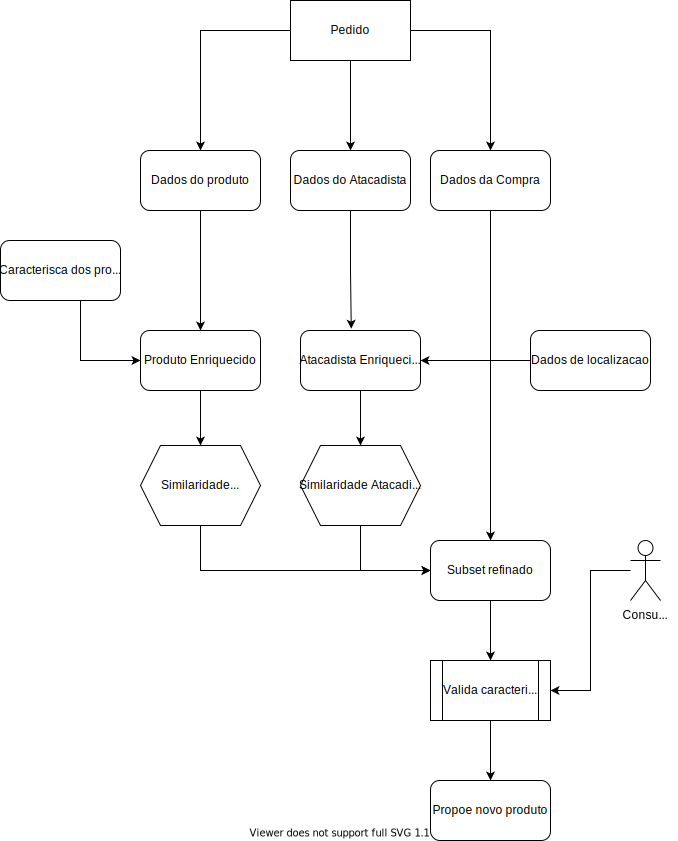

# Recomendação de produtos para pontos de vendas

## Visão Geral

Criar um sistema de recomendação que ajude a companhia a oferecer novos produtos aos PDVs com base na similaridade do perfil do estabelecimento ou no consumo comparado à outros com perfis semelhantes

## Problematica

Auxiliar a companhia, Ambev, a oferecer de forma precisa aos seus clientes produtos que se encaixem no perfil de compra e ofertar novos produtos que sejam similares ao já consumidos. 

Este projeto tem como objetivo propor um modelo de cross selling, oferencendo novos produtos aos consumidores de acordo com as caracteristicas desses itens.

### Proposta

Criar um sistema de recomendação baseada em caracteristicas dos produtos e explorar a possibilidade de um sistema de recomendação hibrido, que leva em consideração as caracteristicas dos produtos (similaridade entre produtos) e caracteristicas do comprador (similaridade comportamental do comprador).

## Informações ténicas

O projeto proposto foi dividido em sessões de análises a fim de melhor identificar quais caracteristicas seriam melhor utilizadas para a solução. Como resultado foram criados os seguintes notebooks:

* 01-Análise Exploratória
* 02-Scrap
* 03-Enriquecimento
* 04-Agregação do Dataset
* 05-Comportamento do Atacadista
* 06-Modelagem Produto
* 07-Recomendação de Produto Atacadista (breffing)


### Grafico explicativo

O gráfico abaixo resume o processo proposto para a solução do problema.



### API

Como entrega, nesse primeiro MVP, foi disponibilizado uma API que fara o recebimento de um payload com algumas caracteristicas levantadas e com base nessas informações será retornado os produtos que melhor se correlaciona com as informações disponibilizadas.

#### Pré-Requisitos

* Sistema Operacional: Linux ou Windows
* Linguagem utilzada: Python3
* Docker
* Bibliotecas:
    * numpy
    * pandas
    * scikit-learn
    * spacy
    * matplotlib
    * seaborn
    * pandas_profiling
    * selenium
    * tickle
    * json
    * fuzzywuzzy
    * tensorflow
    * tensorflow-datasets
    * tensorflow-recommenders
    * flask
    * flask_restfull
    * jupiter notebook
    * python -m spacy download pt_core_news_lg
    * wordcloud

#### Configurando o ambiente

Rodar o seguinte comando, após a instalação do `python 3.x`
```
pip install -r requirements.txt
```

#### Configurando o ambiente para o scraping

Para rodar o notebook 02-Scraping é necessário fazer o download da versão do chrome webdriver no site: https://chromedriver.chromium.org/downloads

Após o download o drive deverá ser salvo no seguinte diretorio `C:\drive\chromedriver.exe`. Caso o diretorio for outro, será necessário alterar o notebook.

#### Testando API

Para executar o projeto é necessário ter o ambiente configurado com Docker e rodar o seguinte comando no diretório `Desafio/api`
```
docker build -t api-recomendacao .
docker run -d --name api-recomendacao -p 5000:5000 api-recomendacao
```

Para executar a request basta fazer uma requisição no seguinte endereço

HTTP POST http://127.0.0.1:5000/api/recomendacao?top=3

payload: 
```json
{
    "TamanhoContainer": 0.55,
    "PercentualAlcoolico": 9.50,
    "Variedade": "Blonde",
    "Descricao": "",
    "Segmento": "SUPER PREMIUM",
    "Harmonizacao": "Arroz, Peixe, Salgados",
    "Ingredientes":"Trigo, Agua, Cevada",
    "Alergico": "Glutten",
    "Temperatura": "0-5",
    "Ibu": 25
}
```

Os dados do payload acima são meramente ilustrativos.

Exemplo do response:
```json
{
    "message": "ok",
    "predict": [
        {
            "Id": 62706,
            "Submarca": NaN,
            "Litros": 0.0,
            "Segmento": NaN,
            "PercentualAlcoolico": 6.600000000000001
        },
        {
            "Id": 62707,
            "Submarca": NaN,
            "Litros": 0.0,
            "Segmento": NaN,
            "PercentualAlcoolico": 6.600000000000001
        },
        {
            "Id": 58277,
            "Submarca": "LEFFE BLONDE",
            "Litros": 0.25,
            "Segmento": "PREMIUM",
            "PercentualAlcoolico": 0.0
        }
    ]
}
```

## Time

* [Guilherme Fernando Angelico](https://github.com/Angelicogfa)

* [Douglas Machado](https://taikai.network/br/douglas-mad)